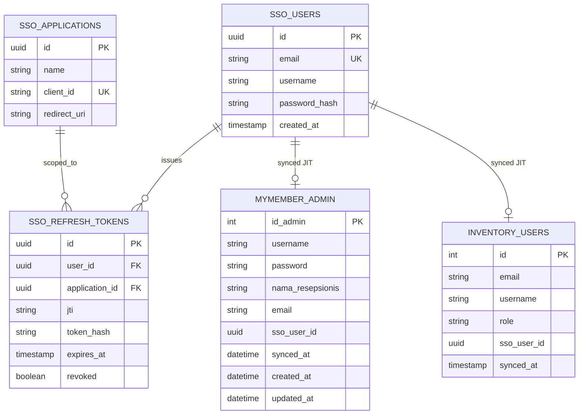

# Product Requirements Document (PRD)
# SSO Engine — Single Sign-On untuk Aplikasi Internal PT Desnet

**Versi:** 1.1
**Tanggal:** 5 Agustus 2026
**Disusun oleh:** Farrel (Intern, Divisi Aplikasi)
**Pembimbing:** Ade Kurniawan (Deputy Manager Aplikasi)
**Status:** Sprint 1 — SSO Engine Foundation

> **Changelog v1.1:** Menghapus kolom `public_key` dari tabel `applications` (SSO hanya punya satu key pair milik SSO Engine sendiri) · Menambahkan claim/kolom `jti` untuk efisiensi blacklist Redis · Mengganti asumsi tabel `MYMEMBER_USERS` menjadi `admin` (tabel existing MyMember yang sudah dikonfirmasi strukturnya) beserta rencana migrasi `ALTER TABLE`.

---

## 1. Pendahuluan

### 1.1 Latar Belakang
PT Desnet memiliki beberapa aplikasi internal yang berjalan secara terpisah, di antaranya **MyMember** (aplikasi member management & kiosk check-in, dibangun dengan CodeIgniter 4) dan **Inventory** (aplikasi manajemen inventori, dibangun dengan Laravel). Saat ini, setiap aplikasi memiliki sistem autentikasi (login) masing-masing yang berdiri sendiri. Ketika jumlah aplikasi internal bertambah, pola ini menimbulkan masalah:

- User harus mengingat kredensial berbeda untuk tiap aplikasi
- Pengelolaan akun user tersebar dan tidak konsisten antar aplikasi
- Tidak ada kontrol terpusat untuk menonaktifkan akses user ke seluruh aplikasi sekaligus

Untuk mengatasi hal ini, dibangun sebuah **SSO Engine** — sistem autentikasi terpusat yang memungkinkan satu akun digunakan untuk mengakses banyak aplikasi berbeda, cukup dengan satu kali login.

### 1.2 Ruang Lingkup Dokumen
Dokumen ini mencakup keseluruhan rancangan SSO Engine: tujuan, arsitektur, database, alur (flow), API contract, keamanan, hingga stack teknologi. Dokumen ini menjadi rujukan utama sebelum dan selama proses development, termasuk untuk AI coding agent yang membantu implementasi.

---

## 2. Tujuan Project

1. Membangun mekanisme login terpusat (SSO) berbasis **JWT (JSON Web Token)** dengan algoritma **RS256**.
2. Memungkinkan user login **satu kali** untuk mengakses banyak aplikasi internal berbeda (MyMember, Inventory, dan aplikasi lain di masa depan).
3. Mendukung aplikasi client dengan **framework berbeda** (tidak terbatas CodeIgniter 4 — termasuk Laravel dan framework lain).
4. Menyediakan mekanisme **Single Logout** — logout dari satu aplikasi akan mengakhiri sesi di seluruh aplikasi yang terhubung.
5. Menjaga **password hanya tersimpan di satu tempat** (SSO Engine), tidak tersebar ke aplikasi client manapun.
6. Menjadi *Proof of Concept* (POC) yang dapat diperluas ke seluruh aplikasi internal PT Desnet setelah terbukti stabil.

---

## 3. Definisi & Istilah

| Istilah | Penjelasan |
|---|---|
| **SSO Engine** | Aplikasi pusat (CI4) yang menangani autentikasi, penerbitan token, dan manajemen sesi. Disebut juga *Identity Provider (IdP)*. |
| **Client App** | Aplikasi yang menggunakan SSO Engine untuk autentikasi (MyMember, Inventory). Disebut juga *Service Provider (SP)*. |
| **JWT (JSON Web Token)** | Format token digital berisi identitas user, ditandatangani secara kriptografis agar tidak bisa dipalsukan. |
| **Access Token** | Token berumur pendek (15 menit) yang digunakan untuk mengakses resource/aplikasi. |
| **Refresh Token** | Token berumur panjang (7 hari) yang digunakan untuk memperoleh access token baru tanpa login ulang. |
| **JIT Provisioning** (*Just-In-Time*) | Strategi sinkronisasi: data user otomatis dibuat/diperbarui di tabel lokal Client App saat proses login terjadi, bukan melalui proses batch terpisah. |
| **Single Logout (SLO)** | Mekanisme di mana logout dari satu Client App memutus sesi di seluruh Client App lain yang terhubung ke SSO yang sama. |
| **RS256** | Algoritma tanda tangan digital asymmetric (private key untuk sign, public key untuk verifikasi). |
| **Token Blacklist** | Daftar token yang sudah tidak valid (setelah logout) meski secara teknis belum expired, disimpan di Redis. |

---

## 4. Arsitektur Sistem

### 4.1 Komponen Utama

```
┌─────────────────────┐
│     SSO Engine       │   ← Pusat autentikasi (CI4)
│  (Identity Provider)  │      Menyimpan: users, applications,
│                       │      refresh_tokens
└──────────┬────────────┘
           │ JWT (RS256)
     ┌─────┴─────┐
     ▼           ▼
┌─────────┐  ┌──────────┐
│ MyMember │  │ Inventory │   ← Client Apps
│  (CI4)   │  │ (Laravel) │      Masing-masing punya tabel
│          │  │           │      users lokal sendiri (hasil sync)
└─────────┘  └──────────┘
```

### 4.2 Prinsip Arsitektur

- **Source of truth untuk identitas** (email, username, password) ada **hanya di SSO Engine**.
- **Source of truth untuk otorisasi** (role, permission) ada di **masing-masing Client App** — SSO Engine tidak mengurus hak akses.
- **Sinkronisasi data** bersifat **one-way** (SSO → Client App) dan **real-time** melalui pola **JIT Provisioning** saat login, bukan melalui cron job/batch terpisah.
- **Token ditandatangani dengan private key** (hanya dipegang SSO Engine) dan **diverifikasi dengan public key** (didistribusikan ke Client App), sehingga Client App tidak pernah bisa menerbitkan token palsu.

### 4.3 Kenapa Setiap Client App Punya Tabel `users` Sendiri?

Meskipun SSO Engine adalah pusat identitas, setiap Client App tetap memerlukan tabel `users` lokal karena:

1. **Foreign key lokal** — tabel lain di Client App (misal `kunjungan` di MyMember) butuh relasi ke user, dan foreign key tidak bisa lintas database/server.
2. **Role & permission spesifik aplikasi** — disimpan lokal, bukan di SSO.
3. **Performa** — menghindari pemanggilan API ke SSO setiap kali butuh data user.
4. **Ketahanan** — Client App tetap bisa menampilkan data lama meski SSO Engine sedang down (hanya proses login baru yang terganggu).

---

## 5. Alur Sistem (Flow)

### 5.1 Flow Login (dengan JIT Provisioning)

1. User mengakses Client App (misal MyMember).
2. Client App mengecek apakah ada sesi lokal valid.
   - Jika **ada** → akses langsung diizinkan.
   - Jika **tidak ada** → redirect ke SSO Engine (`GET /authorize`) dengan membawa `client_id`, `redirect_uri`, dan `state` (anti-CSRF).
3. SSO Engine memvalidasi `client_id` dan `redirect_uri` terhadap tabel `applications`.
4. User memasukkan email + password di halaman login SSO.
5. SSO Engine memvalidasi kredensial, lalu men-generate **access token** dan **refresh token** (JWT RS256).
6. SSO Engine redirect kembali ke `redirect_uri` milik Client App, menyertakan token dan `state` yang sama (untuk divalidasi ulang oleh Client App guna mencegah CSRF).
7. Client App memvalidasi token menggunakan public key SSO.
8. Client App mengecek apakah email dari token sudah ada di tabel `users` lokal:
   - **Belum ada** → insert user baru dengan role default minimum (JIT Provisioning).
   - **Sudah ada namun berbeda** → update data (sync).
9. Sesi lokal dibuat, akses diizinkan.

### 5.2 Flow Single Logout

1. User klik logout di salah satu Client App (misal MyMember).
2. Client App memanggil endpoint `POST /logout` di SSO Engine, mengirimkan refresh token.
3. SSO Engine me-revoke refresh token tersebut di database.
4. Token (access & refresh) dimasukkan ke **blacklist di Redis**.
5. Saat Client App lain melakukan validasi token berikutnya (request apapun), mereka mengecek blacklist — jika ditemukan, sesi lokal di app tersebut ikut dihapus.

> **Catatan teknis:** JWT bersifat *stateless*, sehingga tidak bisa "ditarik kembali" begitu diterbitkan. Solusinya adalah kombinasi: access token berumur pendek (15 menit) + mekanisme blacklist di Redis untuk kasus logout eksplisit sebelum token expired secara alami.

---

## 6. Skema Database (ERD)

### 6.1 Tabel di SSO Engine

**`users`**
| Kolom | Tipe | Keterangan |
|---|---|---|
| id | UUID (PK) | |
| email | VARCHAR, UNIQUE | Digunakan sebagai identifier utama |
| username | VARCHAR | |
| password_hash | VARCHAR | Satu-satunya tempat password disimpan di seluruh sistem |
| created_at | TIMESTAMP | |

**`applications`**
| Kolom | Tipe | Keterangan |
|---|---|---|
| id | UUID (PK) | |
| name | VARCHAR | Nama aplikasi (mis. "MyMember") |
| client_id | VARCHAR, UNIQUE | Identifier unik client |
| redirect_uri | VARCHAR | URL callback tempat token dikirim setelah login sukses |

> **Catatan:** tidak ada kolom `public_key` di tabel ini. SSO Engine hanya memiliki **satu** RSA key pair (disimpan di folder `keys/`), dan public key yang sama didistribusikan ke seluruh Client App melalui endpoint `GET /public-key`. Tiap aplikasi tidak memiliki key pair sendiri.

**`refresh_tokens`**
| Kolom | Tipe | Keterangan |
|---|---|---|
| id | UUID (PK) | |
| user_id | UUID (FK → users.id) | |
| application_id | UUID (FK → applications.id) | |
| jti | VARCHAR, UNIQUE | JWT ID — identifier unik yang disematkan di payload access token, dipakai sebagai key ringkas saat blacklist di Redis (menghindari penyimpanan seluruh string JWT) |
| token_hash | VARCHAR | Refresh token disimpan dalam bentuk hash |
| expires_at | TIMESTAMP | Default: 7 hari dari penerbitan |
| revoked | BOOLEAN | Ditandai `true` saat logout |

### 6.2 Tabel di Client App (MyMember & Inventory)

**`admin`** (MyMember — tabel existing, di-`ALTER` bukan dibuat baru)

MyMember sudah memiliki tabel `admin` yang berperan sebagai user login staff/resepsionis, dengan struktur sebagai berikut (dikonfirmasi langsung dari database):

| Kolom | Tipe | Status |
|---|---|---|
| id_admin | INT, PK, AUTO_INCREMENT | Sudah ada |
| username | VARCHAR(50) | Sudah ada |
| password | VARCHAR(255) | Sudah ada — **tidak lagi dipakai untuk proses login** setelah SSO aktif, dibiarkan sebagai data legacy |
| nama_resepsionis | VARCHAR(100) | Sudah ada |
| created_at, updated_at | DATETIME | Sudah ada |
| **email** | VARCHAR(255) | **Kolom baru** — wajib ditambahkan, prasyarat karena SSO menggunakan email sebagai unique identifier |
| **sso_user_id** | CHAR(36) | **Kolom baru** — referensi logis ke `SSO_USERS.id` |
| **synced_at** | DATETIME | **Kolom baru** — waktu sinkronisasi JIT terakhir |

Migration yang diperlukan saat Sprint 2 (integrasi MyMember):
```sql
ALTER TABLE admin ADD COLUMN email VARCHAR(255) NULL;
ALTER TABLE admin ADD COLUMN sso_user_id CHAR(36) NULL;
ALTER TABLE admin ADD COLUMN synced_at DATETIME NULL;
```

> **Catatan migrasi data:** admin yang sudah ada saat ini login memakai `username`, bukan email, sehingga belum memiliki data `email`. Sebelum go-live, perlu diputuskan apakah email diisi manual (data asli tiap admin) atau digenerate sementara (misal `username@mymember.internal`) agar sistem tetap berjalan sambil menunggu data asli. Keputusan ini belum final dan akan dibahas saat Sprint 2.

**`users`** (Inventory — tabel baru, karena project belum dibuat)
| Kolom | Tipe | Keterangan |
|---|---|---|
| id | INT (PK) | Primary key lokal (default Laravel) |
| email | VARCHAR | Hasil sync dari SSO |
| username | VARCHAR | Hasil sync dari SSO |
| role | VARCHAR | **Spesifik per-aplikasi**, tidak diketahui/diurus oleh SSO |
| sso_user_id | UUID | Referensi logis ke `SSO_USERS.id`, bukan FK database sungguhan |
| synced_at | TIMESTAMP | Waktu sinkronisasi terakhir |

> Field `password_hash`/`password` **tidak ada fungsinya untuk login** di kedua tabel Client App di atas — Client App tidak pernah menyimpan atau memvalidasi password sendiri setelah SSO aktif.

### 6.3 ERD Final (Mermaid)



---

## 7. API Contract (SSO Engine)

### `GET /authorize`
Memulai proses login. Dipanggil oleh Client App via redirect browser.

**Query Params:**
| Param | Wajib | Keterangan |
|---|---|---|
| client_id | Ya | Identifier Client App, harus terdaftar di tabel `applications` |
| redirect_uri | Ya | Harus cocok dengan yang terdaftar untuk `client_id` tersebut |
| state | Ya | Nilai acak dari Client App, dikembalikan apa adanya untuk validasi anti-CSRF |

**Response:** Menampilkan halaman HTML form login.

---

### `POST /login` *(disubmit dari form halaman `/authorize`)*
Memvalidasi kredensial dan menerbitkan token.

**Body:**
```json
{
  "email": "user@desnet.co.id",
  "password": "********",
  "client_id": "...",
  "redirect_uri": "...",
  "state": "..."
}
```

**Behavior:**
- Jika kredensial valid → generate access token (exp 15 menit) & refresh token (exp 7 hari), redirect ke `redirect_uri` dengan query `?token=...&state=...`.
- Jika kredensial tidak valid → response 401, tampilkan error di halaman login.

**Struktur payload access token (JWT):**
```json
{
  "iss": "sso-engine",
  "sub": "<user_id>",
  "jti": "<uuid unik untuk token ini>",
  "email": "user@desnet.co.id",
  "username": "budi123",
  "iat": 1234567890,
  "exp": 1234568790
}
```
Claim `jti` wajib disertakan agar proses blacklist saat logout (lihat `POST /logout`) cukup menyimpan ID pendek ini di Redis, bukan seluruh string token.

---

### `GET /public-key`
Mengembalikan public key SSO Engine dalam format teks, untuk digunakan Client App saat verifikasi JWT.

**Response:** `text/plain`, isi public key PEM format.

---

### `POST /refresh-token`
Menerbitkan access token baru tanpa login ulang.

**Body:**
```json
{ "refresh_token": "..." }
```

**Behavior:**
- Validasi refresh token terhadap tabel `refresh_tokens` (belum revoked, belum expired).
- Jika valid → terbitkan access token baru.
- Jika tidak valid/expired → response 401, Client App harus redirect ulang ke `/authorize`.

---

### `POST /logout`
Mengakhiri sesi user secara global (Single Logout).

**Body:**
```json
{ "refresh_token": "..." }
```

**Behavior:**
- Set `revoked = true` pada refresh token terkait di database.
- Masukkan access token & refresh token ke blacklist Redis.
- Response 200 jika berhasil.

---

## 8. Fitur (Ringkasan Fungsional)

| No | Fitur | Deskripsi |
|---|---|---|
| 1 | Login terpusat | User login sekali di SSO, bisa akses semua Client App terhubung |
| 2 | Penerbitan JWT RS256 | Access token & refresh token ditandatangani asymmetric |
| 3 | Distribusi public key | Endpoint khusus agar Client App bisa ambil public key secara dinamis |
| 4 | Refresh token | Perpanjang sesi tanpa login ulang |
| 5 | Single Logout | Logout satu app memutus sesi semua app terhubung |
| 6 | JIT Provisioning | Auto-create/update user di tabel lokal Client App saat login pertama |
| 7 | Proteksi CSRF pada redirect flow | Parameter `state` mencegah penyisipan token oleh pihak tidak sah |
| 8 | Registrasi Client App | Data `client_id` dan `redirect_uri` didaftarkan di tabel `applications` sebagai prasyarat integrasi |

---

## 9. Kebutuhan Keamanan (Security Requirements)

- Seluruh komunikasi **wajib HTTPS** di lingkungan produksi.
- Password di-hash menggunakan `password_hash()` (bcrypt/argon2), tidak pernah disimpan plain text.
- Token JWT ditandatangani dengan **RS256**, bukan HS256 — private key **hanya** ada di SSO Engine.
- Parameter **`state`** wajib divalidasi di sisi Client App untuk mencegah CSRF pada redirect callback.
- Access token berumur pendek (15 menit) untuk membatasi window risiko jika token bocor.
- Refresh token disimpan dalam bentuk **hash**, bukan plain text, di database.
- Mekanisme **blacklist Redis** wajib dicek di setiap validasi token guna mendukung Single Logout.
- Redirect hanya diperbolehkan ke `redirect_uri` yang **sudah terdaftar** di tabel `applications` (mencegah open redirect).

---

## 10. Stack Teknologi

| Layer | Teknologi |
|---|---|
| **SSO Engine — Backend** | PHP, CodeIgniter 4 |
| **SSO Engine — Database** | MySQL |
| **Token** | JWT (RS256) via library `firebase/php-jwt` |
| **Session/Blacklist Store** | Redis |
| **Client App — MyMember** | PHP, CodeIgniter 4 (existing project) |
| **Client App — Inventory** | PHP, Laravel (project baru, fokus awal hanya modul auth untuk testing) |
| **Testing API** | Postman |
| **Dokumentasi diagram** | Mermaid (ERD & flowchart) |
| **Project management** | Jira |

---

## 11. Batasan & Asumsi (Out of Scope Sprint 1)

Hal-hal berikut **belum** menjadi bagian dari Sprint 1 (5–19 Agustus 2026), dan direncanakan masuk ke Sprint 2:

- Integrasi middleware/filter JWT di sisi MyMember (CI4)
- Setup project Inventory (Laravel) dan middleware validasi token di sisinya
- Testing end-to-end lintas aplikasi (MyMember ↔ SSO ↔ Inventory)
- Mekanisme refresh token otomatis di sisi Client App (silent refresh)
- UI/UX halaman login yang sudah final secara desain (Sprint 1 fokus fungsional)
- Audit log & monitoring aktivitas login

Sprint 1 secara khusus difokuskan untuk membangun **SSO Engine yang solid dan teruji secara mandiri** sebelum ada Client App yang mulai terintegrasi ke sistem ini.

---

## 12. Kriteria Sukses (Definition of Done — Sprint 1)

SSO Engine dianggap selesai untuk Sprint 1 jika:

1. Seluruh endpoint (`/authorize`, `/login`, `/public-key`, `/refresh-token`, `/logout`) berfungsi sesuai API contract di atas.
2. Token JWT berhasil di-generate dan diverifikasi menggunakan RSA key pair (RS256).
3. Parameter `state` tervalidasi dengan benar untuk mencegah CSRF.
4. Refresh token tersimpan sebagai hash dan dapat digunakan untuk menerbitkan access token baru.
5. Logout berhasil merevoke refresh token dan memasukkan token ke blacklist Redis.
6. Seluruh skenario telah diuji melalui Postman: login sukses, login gagal, token expired, refresh token, dan logout.
7. Data `applications` untuk MyMember dan Inventory sudah terdaftar sebagai client resmi.

---

## 13. Referensi Internal

- ERD & flowchart lengkap alur SSO (sudah didokumentasikan dalam format Mermaid, tersedia terpisah)
- Backlog Sprint 1 (`SSO_Backlog_Jira_v2.csv` / `.xlsx`)
- Diskusi teknis awal dengan pembimbing (Ade Kurniawan, Deputy Manager Aplikasi) — konfirmasi kebutuhan dasar SSO dan keputusan teknis (JWT, sinkronisasi one-way, Single Logout)
