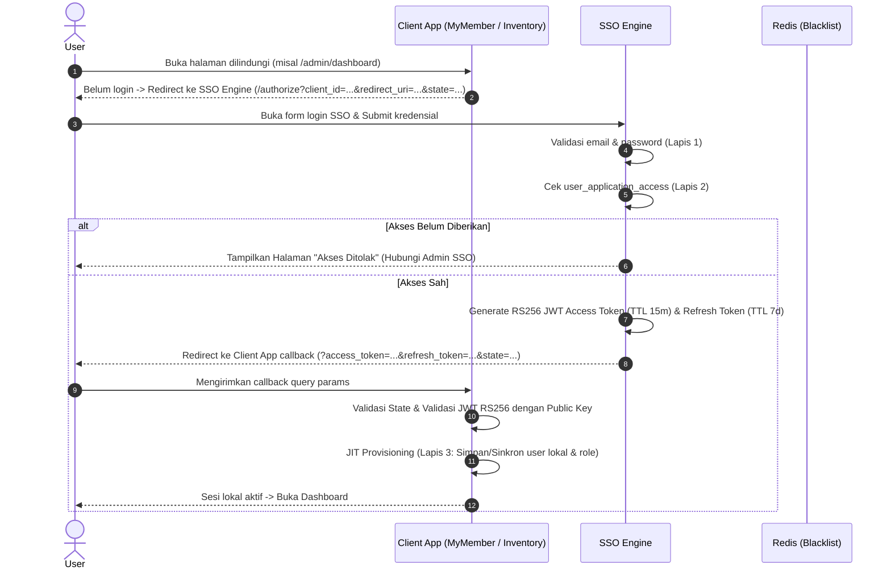
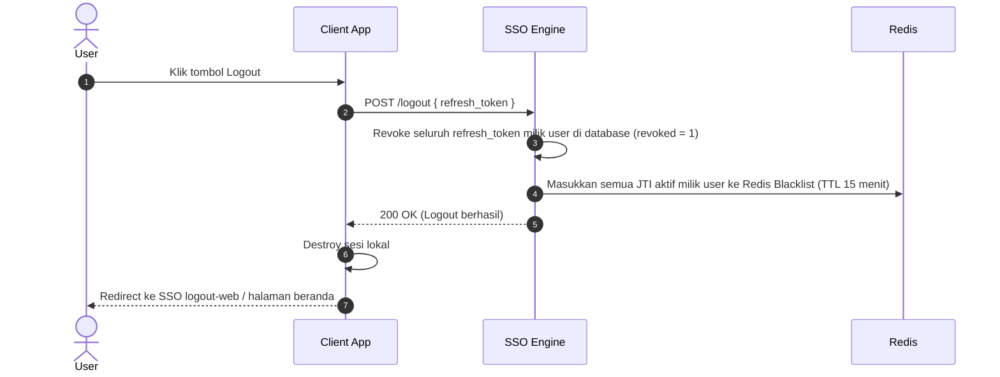

# 🛡️ SSO Engine (Single Sign-On Central Identity & Authorization Provider)

SSO Engine adalah sistem autentikasi dan otorisasi terpusat berbasis **OAuth2/OpenID-Connect-like protocol** yang dirancang untuk mengamankan ekosistem multi-aplikasi internal perusahaan (seperti *MyMember*, *Inventory App*, dll.). 

SSO Engine mengimplementasikan **Arsitektur Otorisasi 3 Lapis (3-Tier Authorization)**, enkripsi asimetris **JWT RS256**, **Token Refresh Rotation**, serta mekanisme **Single Logout (SLO)** yang terkoordinasi secara instan menggunakan **Redis Token Blacklist**.

---

## Arsitektur Otorisasi 3 Lapis

SSO Engine memisahkan tanggung jawab autentikasi dan otorisasi ke dalam 3 lapis independen dengan prinsip *least privilege* dan *defense-in-depth*:

```
┌────────────────────────────────────────────────────────────────────────┐
│                          SSO ENGINE (Pusat)                            │
│                                                                        │
│  [ Lapis 1: IDENTITAS ]                                                │
│  "Siapa orang ini?" ──► Tabel `users` (Email, Username, Password)     │
│                                                                        │
│  [ Lapis 2: AKSES APLIKASI ]                                           │
│  "Aplikasi mana yang boleh dia buka?" ──► Tabel `user_application_access`
└───────────────────────────────────┬────────────────────────────────────┘
                                    │ (JWT RS256 Access Token)
                                    ▼
┌────────────────────────────────────────────────────────────────────────┐
│                        CLIENT APP (Inventory / MyMember)               │
│                                                                        │
│  [ Lapis 3: ROLE & PERMISSION INTERNAL ]                               │
│  "Begitu masuk aplikasi, dia jadi apa?"                                │
│  ──► `pending_role_assignments` / tabel `users`/`admin` lokal           │
└────────────────────────────────────────────────────────────────────────┘
```

| Lapis | Pertanyaan Kunci | Dikelola di | Dikelola Oleh | Mekanisme |
|---|---|---|---|---|
| **Lapis 1: Identitas** | *"Siapa orang ini?"* | SSO Engine (`users`) | Admin SSO Pusat | Akun dibuat terpusat di `/admin/users` + aktivasi email via SMTP. |
| **Lapis 2: Akses Aplikasi** | *"Aplikasi apa saja yang boleh dibuka?"* | SSO Engine (`user_application_access`) | Admin SSO Pusat | Mapping hak akses aplikasi (Inventory, MyMember) di menu Kelola Akses. |
| **Lapis 3: Role Internal** | *"Di dalam aplikasi, dia menjabat apa?"* | Client App (`pending_role_assignments` / `admin`) | Admin Masing-Masing Aplikasi | Admin Client menentukan role internal (`admin`, `staff`, `approver`, dll.). |

> **Prinsip Keamanan:**
> Penolakan akses aplikasi (Lapis 2) terjadi di SSO Engine **sebelum authorization token diterbitkan**. Jika karyawan belum diizinkan membuka aplikasi tertentu, token tidak akan pernah dikirimkan ke aplikasi client.

---

## Fitur Utama

- **Pendaftaran 1 Pintu (Centralized Provisioning):** Registrasi mandiri publik dinonaktifkan. Seluruh pembuatan akun karyawan dilakukan secara terkontrol oleh Admin SSO Pusat.
- **Aktivasi Akun & Reset Password via Email:** Mengirimkan secure activation/reset token berbasis waktu ke email pengguna menggunakan template HTML responsif.
- **Enkripsi Token Asimetris (RS256):** SSO Engine menandatangani JWT dengan *Private Key* (2048-bit RSA). Client App memvalidasi JWT secara mandiri menggunakan *Public Key* tanpa membebani database SSO.
- **Distribusi Public Key Otomatis (`GET /public-key`):** Client App dapat mengambil dan mencache Public Key secara dinamis.
- **Silent Refresh Token Rotation:** Memperpanjang sesi aplikasi secara transparan di balik layar sebelum access token (TTL 15 menit) kedaluwarsa, dengan merotasi refresh token (TTL 7 hari) setiap kali digunakan.
- **True Single Logout (SLO) dengan Redis Blacklist:** Saat pengguna logout dari salah satu aplikasi client, SSO Engine secara otomatis merevoke seluruh refresh token pengguna dan memasukkan seluruh `jti` (JWT ID) aktif ke Redis Blacklist (TTL 15 menit).
- **Dashboard Admin SSO Modern:** Tampilan dashboard berbasis glassmorphism & TailwindCSS untuk mengelola pengguna, aktivasi ulang akun, serta hak akses multi-aplikasi.

---

## Protokol & Alur SSO

### 1. Alur Autentikasi & Otorisasi (Login)



### 2. Alur Silent Refresh Token

Ketika Access Token hampir kedaluwarsa (misal sisa < 60 detik):
1. Client App mengirimkan `POST /refresh-token` dengan JSON payload `{ refresh_token, client_id }`.
2. SSO Engine memvalidasi hash refresh token dan memeriksa apakah akses aplikasi pengguna masih aktif (`revoked_at IS NULL`).
3. SSO Engine menerbitkan **Access Token baru** dan **Refresh Token baru** (Rotation).
4. Client App memperbarui sesi lokal tanpa mengganggu aktivitas pengguna.

### 3. Alur Single Logout (SLO)



---

## Daftar Endpoint API & Web

| Method | Endpoint | Tipe | Deskripsi |
|---|---|---|---|
| `GET` | `/authorize` | Web | Memulai alur login SSO (menerima `client_id`, `redirect_uri`, `state`). |
| `POST` | `/login` | Web | Memproses login kredensial pengguna dan memverifikasi akses aplikasi (Lapis 2). |
| `GET` | `/public-key` | API (Public) | Mengembalikan Public Key format PEM untuk verifikasi JWT oleh client. |
| `POST` | `/refresh-token` | API (JSON) | Melakukan rotasi refresh token dan menerbitkan access token baru. |
| `POST` | `/logout` | API (JSON) | Single Logout: merevoke semua sesi dan mem-blacklist JTI ke Redis. |
| `GET` | `/logout-web` | Web | Membersihkan sesi SSO pada browser dan me-redirect kembali ke client. |
| `GET` | `/forgot-password` | Web | Form permintaan reset/lupa password. |
| `POST` | `/forgot-password/process` | Web | Mengirim email link reset password. |
| `GET` | `/reset-password` | Web | Form pembuatan password baru (aktivasi & reset). |
| `POST` | `/reset-password/process` | Web | Menyimpan password baru dan menghapus token reset. |
| `GET` | `/authorize-admin` | Web | Form login khusus Admin SSO Pusat. |
| `GET` | `/admin/users` | Web (Protected) | Dashboard Admin SSO: Daftar user, tambah user baru & kirim aktivasi. |
| `GET` | `/admin/users/{id}/access` | Web (Protected) | Kelola hak akses aplikasi (Lapis 2) per user. |
| `POST` | `/admin/users/{id}/access` | Web (Protected) | Memberikan izin akses aplikasi kepada user. |
| `POST` | `/admin/users/{id}/access/{appId}/revoke` | Web (Protected) | Mencabut izin akses aplikasi dari user. |

---

## Panduan Integrasi Client App

### 1. Registrasi Client di SSO Engine
Pastikan Client App sudah terdaftar di tabel `applications`:
- `name`: Nama aplikasi (misal `Inventory` atau `MyMember`)
- `client_id`: Identifikator unik (misal `inventory-app` atau `mymember-app`)
- `redirect_uri`: URL callback aplikasi (misal `https://inventory.test/callback` atau `https://mymember.test/auth/callback`)

### 2. Validasi Token di Client App
Client App membaca Public Key dari SSO Engine atau menyimpannya di lokal (`keys/sso_public.pem`).
Contoh decoding token di Client App (PHP):

```php
use Firebase\JWT\JWT;
use Firebase\JWT\Key;

$publicKey = file_get_contents('/path/to/sso_public.pem');
$decodedClaims = JWT::decode($accessToken, new Key($publicKey, 'RS256'));

// Payload Claims yang tersedia:
// $decodedClaims->sub          : UUID User SSO
// $decodedClaims->email        : Email User
// $decodedClaims->username     : Username User
// $decodedClaims->jti          : ID Unik Token Sesi
// $decodedClaims->is_sso_admin : Boolean status admin SSO
// $decodedClaims->exp          : Unix Timestamp Expiration
```

### 3. JIT (Just-In-Time) Provisioning di Client App
Begitu JWT berhasil divalidasi di callback, Client App memeriksa tabel lokal:
- **MyMember (Single Role):** Cek apakah user ada di tabel `admin`. Jika belum, buatkan akun lokal secara otomatis menggunakan data dari claims (`sub`, `email`, `username`).
- **Inventory (Multi-Role):** Cek tabel `pending_role_assignments` untuk email user tersebut. Jika Admin Inventory sudah menyiapkan rolenya (`admin` / `staff`), buatkan user lokal dengan role tersebut.

### 4. Implementasi Single Logout (SLO) di Client App
Untuk memastikan *Single Logout* terkoordinasi antar aplikasi dengan akun yang sama:
1. Client App memanggil API `POST /logout` ke SSO Engine dengan payload `{ "refresh_token": "..." }`.
2. Client App menghapus sesi lokal (`session()->destroy()`).
3. Client App mengarahkan browser user ke `GET /logout-web?redirect_to=<url_login_client>` agar sesi SSO di browser juga dibersihkan.

Contoh Controller Logout di Client App (CodeIgniter 4):
```php
public function logout()
{
    $refreshToken = session()->get('refresh_token');

    // 1. Panggil API SSO Engine /logout
    if (!empty($refreshToken)) {
        try {
            $client = \Config\Services::curlrequest([
                'base_uri'    => env('SSO_BASE_URL', 'http://sso-engine.test'),
                'timeout'     => 5,
                'http_errors' => false,
            ]);

            $client->post('/logout', [
                'json' => [
                    'refresh_token' => $refreshToken,
                ],
            ]);
        } catch (\Exception $e) {
            log_message('error', 'Gagal memanggil SSO logout: ' . $e->getMessage());
        }
    }

    // 2. Bersihkan sesi lokal
    session()->destroy();

    // 3. Redirect ke SSO logout-web untuk membersihkan sesi SSO browser
    $clientLoginUrl = site_url('login');
    $ssoLogoutUrl   = rtrim(env('SSO_BASE_URL', 'http://sso-engine.test'), '/') . '/logout-web?redirect_to=' . urlencode($clientLoginUrl);

    return redirect()->to($ssoLogoutUrl);
}
```

### 5. Implementasi Instant Real-time SLO di AuthFilter Client App (Opsi 2)
Untuk mewujudkan **Single Logout Instan (0 Detik Delay)**, `AuthFilter` pada Client App (MyMember & Inventory) memverifikasi token JWT offline dan mengecek status `$jti` ke Redis Blacklist di setiap request:

```php
<?php

namespace App\Filters;

use CodeIgniter\Filters\FilterInterface;
use CodeIgniter\HTTP\RequestInterface;
use CodeIgniter\HTTP\ResponseInterface;
use Firebase\JWT\JWT;
use Firebase\JWT\Key;
use Predis\Client as PredisClient;

class AuthFilter implements FilterInterface
{
    public function before(RequestInterface $request, $arguments = null)
    {
        $accessToken = session()->get('access_token');

        if (empty($accessToken)) {
            return redirect()->to(site_url('login'))->with('error', 'Silakan login terlebih dahulu.');
        }

        try {
            // 1. Verifikasi Signature JWT secara Offline (Super Cepat)
            $publicKey = file_get_contents(APPPATH . '../keys/sso_public.pem');
            $decoded = JWT::decode($accessToken, new Key($publicKey, 'RS256'));

            // 2. INSTANT SLO: Cek JTI ke Redis Blacklist (< 1ms)
            if (!empty($decoded->jti)) {
                if ($this->isTokenBlacklisted($decoded->jti)) {
                    session()->destroy();
                    return redirect()->to(site_url('login'))->with('error', 'Sesi Anda telah diakhiri dari aplikasi lain.');
                }
            }

            // Simpan info user ke request
            $request->user = $decoded;

        } catch (\Firebase\JWT\ExpiredException $e) {
            // Access Token expired (>15 menit) -> Lakukan Silent Refresh ke SSO Engine
            return $this->handleSilentRefresh();
        } catch (\Exception $e) {
            session()->destroy();
            return redirect()->to(site_url('login'))->with('error', 'Sesi tidak valid.');
        }
    }

    private function isTokenBlacklisted(string $jti): bool
    {
        try {
            $redis = new PredisClient([
                'scheme'   => 'tcp',
                'host'     => env('REDIS_HOST', '127.0.0.1'),
                'port'     => (int) env('REDIS_PORT', 6379),
                'password' => env('REDIS_PASSWORD', null) ?: null,
                'timeout'  => 0.5, // Timeout 500ms agar aman dan tidak membebani request
            ]);

            return (bool) $redis->exists('sso_blacklist:jti:' . $jti);
        } catch (\Exception $e) {
            // Fallback aman jika server Redis tidak dapat dijangkau
            log_message('warning', 'Redis Blacklist check skipped: ' . $e->getMessage());
            return false;
        }
    }

    private function handleSilentRefresh()
    {
        $refreshToken = session()->get('refresh_token');
        if (empty($refreshToken)) {
            session()->destroy();
            return redirect()->to(site_url('login'));
        }

        try {
            $client = \Config\Services::curlrequest([
                'base_uri'    => env('SSO_BASE_URL', 'http://sso-engine.test'),
                'timeout'     => 5,
                'http_errors' => false,
            ]);

            $response = $client->post('/refresh-token', [
                'json' => [
                    'refresh_token' => $refreshToken,
                    'client_id'     => env('SSO_CLIENT_ID'),
                ]
            ]);

            if ($response->getStatusCode() === 200) {
                $data = json_decode($response->getBody(), true);
                session()->set([
                    'access_token'  => $data['access_token'],
                    'refresh_token' => $data['refresh_token'],
                ]);
                return; // Lanjut ke halaman yang dituju
            }
        } catch (\Exception $e) {
            log_message('error', 'Silent refresh error: ' . $e->getMessage());
        }

        // Jika refresh token gagal / revoked -> logout
        session()->destroy();
        return redirect()->to(site_url('login'))->with('error', 'Sesi login Anda telah berakhir.');
    }

    public function after(RequestInterface $request, ResponseInterface $response, $arguments = null)
    {
        // No-op
    }
}
```

---

## Instalasi & Konfigurasi Lokal

### Prasyarat
- PHP 8.2+ dengan ekstensi `curl`, `openssl`, `mbstring`, `mysqli`, `redis`.
- MySQL / MariaDB Server.
- Redis Server (berjalan di port default 6379).
- Composer.

### Langkah Instalasi

1. **Clone repository & masuk ke direktori:**
   ```bash
   cd d:/laragon/www/sso-engine
   ```

2. **Install dependensi Composer:**
   ```bash
   composer install
   ```

3. **Konfigurasi Environment (`.env`):**
   Salin berkas `env` menjadi `.env` dan sesuaikan konfigurasi:
   ```ini
   CI_ENVIRONMENT = development

   app.baseURL = 'http://sso-engine.test/'

   database.default.hostname = localhost
   database.default.database = sso_engine
   database.default.username = root
   database.default.password =
   database.default.DBDriver = MySQLi

   # Redis Configuration (Token Blacklist)
   redis.host = 127.0.0.1
   redis.port = 6379
   redis.password =
   redis.database = 0

   # SMTP Configuration (Aktivasi Akun & Reset Password)
   email.protocol = smtp
   email.SMTPHost = sandbox.smtp.mailtrap.io
   email.SMTPUser = "your_smtp_user"
   email.SMTPPass = "your_smtp_pass"
   email.SMTPPort = 2525
   email.SMTPCrypto = tls
   ```

4. **Jalankan Migrasi & Database Seeder:**
   ```bash
   php spark migrate
   php spark db:seed DatabaseSeeder
   ```

5. **Generate RSA Keypair (jika belum tersedia di folder `keys/`):**
   ```bash
   # Private Key (2048-bit)
   openssl genrsa -out keys/private.pem 2048

   # Public Key
   openssl rsa -in keys/private.pem -pubout -out keys/public.pem
   ```

6. **Jalankan Server Lokal:**
   Gunakan virtual host Laragon (`http://sso-engine.test`) atau jalankan PHP built-in server:
   ```bash
   php spark serve --port 8080
   ```

---

## Testing & Postman Collection

Berkas **`SSO_Engine_Postman_Collection.json`** telah disertakan di root project untuk memudahkan pengujian API:
- `GET /public-key`
- `POST /refresh-token` (Validasi rotasi & kedaluwarsa)
- `POST /logout` (Pengujian Single Logout & Redis Blacklist)
- `POST /api/test-login` (Simulasi login langsung di environment development)

---

## Lisensi & Hak Cipta

© 2026 **SSO Engine** Dikembangkan untuk standardisasi autentikasi dan otorisasi multi-aplikasi internal perusahaan.
